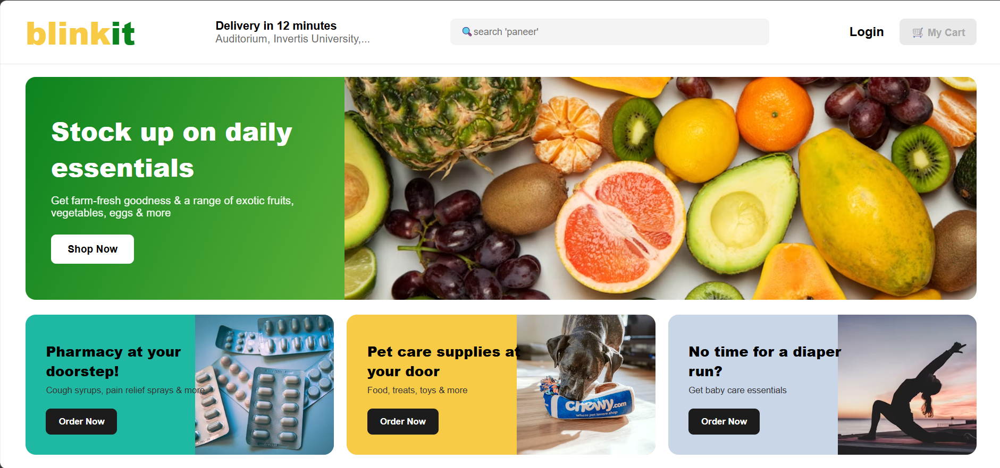

# Blinkit Clone

A front-end clone of the Blinkit homepage, built using **HTML** and **CSS** as a practice project.

## 🖼️ Screenshot



## 📋 Features

- Responsive header with logo, delivery location, search bar, login, and cart
- Hero banner section with gradient background and call-to-action button
- Three promotional cards (Pharmacy, Pet Care, Baby Care) with images

## 🛠️ Built With

- HTML5
- CSS3 (Flexbox & Grid)

## 📂 Project Structure

```
blinkit-clone/
├── index.html
├── style.css
└── README.md
```

## 🚀 Getting Started

1. Clone this repository or download the files
2. Open `index.html` in your browser
3. That's it — no build tools or dependencies required

## 📸 Reference

This project recreates the Blinkit homepage layout for learning purposes only. All brand names, logos, and imagery belong to their respective owners.

## ✍️ Author

Made with 💛💚 while learning HTML & CSS.
